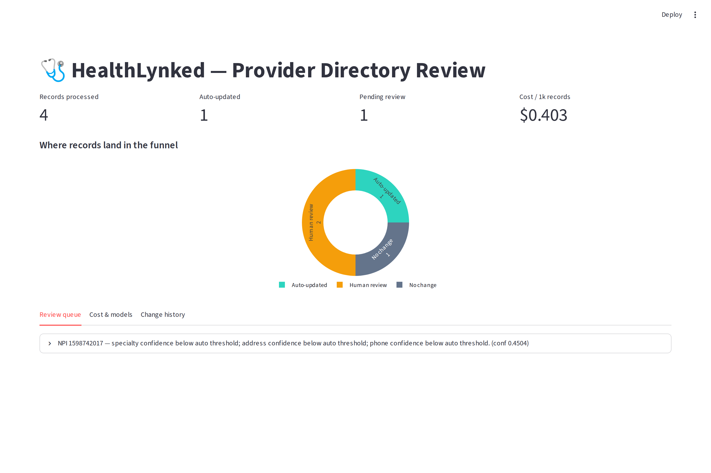
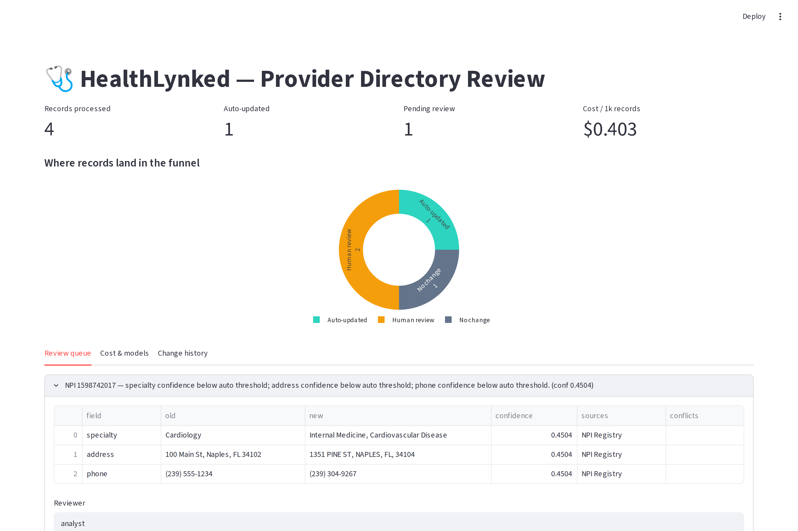
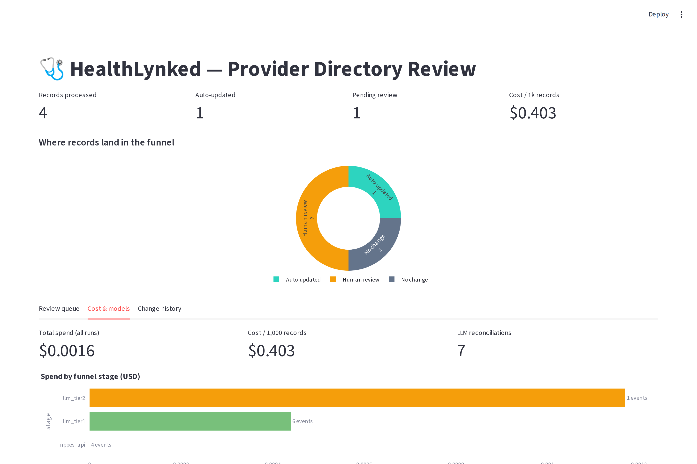
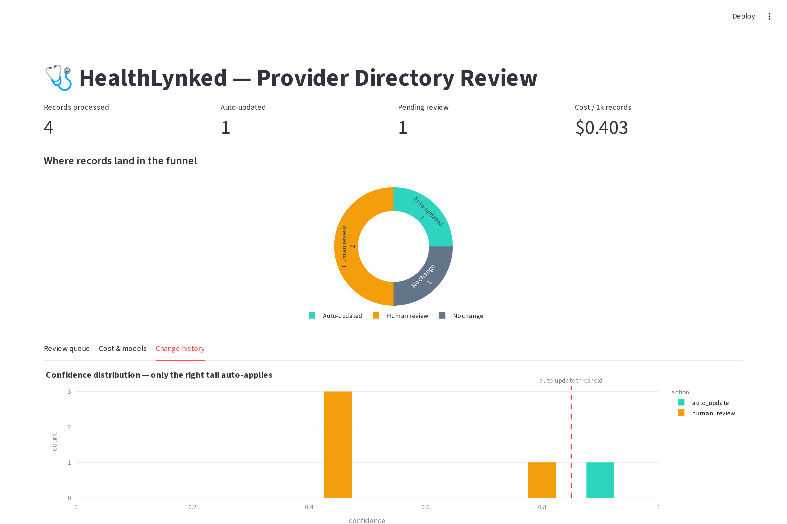
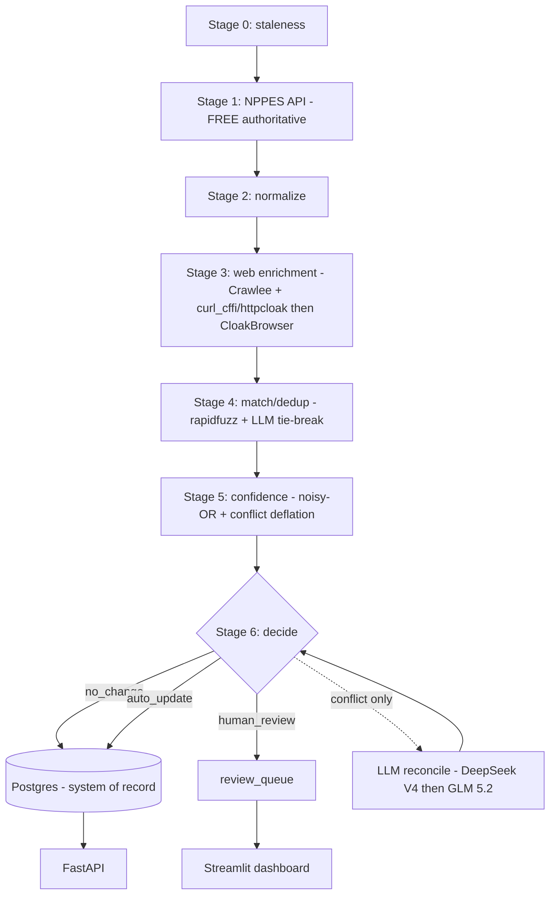

# HealthLynked — Provider & Practice Directory Update Pipeline

A repeatable, **cost-efficient** AI pipeline that keeps a provider/practice directory
accurate: it finds stale records, verifies them against trusted public sources,
scores confidence, **auto-applies safe high-confidence updates**, routes the rest to
human review, and keeps a full audit trail.

> **Hybrid submission (Option C):** a working prototype that runs end-to-end on
> **live data** (real NPIs via the free NPPES API) + this architecture document
> with diagram, cost model, and confidence formula.

---

## TL;DR — the core idea is a **Cost Funnel**

The biggest cost lever isn't which model you pick — it's **how few records reach the
expensive stages**. The authoritative source is already *free and structured*
(NPPES NPI Registry API), so we lead with free APIs + deterministic logic and only
escalate the residual to scraping, then to an LLM.

```
HealthLynked records
   │
 [0] Staleness / risk scoring ........ FREE, deterministic   → only check what's stale
 [1] Free authoritative sources ...... FREE  NPPES API (live) + CMS bulk
 [2] Normalize ....................... FREE  address / phone / name / specialty
 [3] Web enrichment (gaps/conflicts) . Crawlee → curl_cffi/httpcloak → CloakBrowser
 [4] Match / dedup ................... FREE blocking + rapidfuzz; LLM only if ambiguous
 [5] Confidence scoring .............. source-weighted noisy-OR + conflict deflation
 [6] Decision ........................ no_change | auto_update | human_review
        └─ LLM reconciliation fires ONLY on genuine conflicts (DeepSeek V4 → GLM 5.2)
 [7] Audit + persistence (Postgres) .. + Streamlit review dashboard
```

Each stage filters, so per-record cost collapses: **most fields resolve for $0**,
the LLM touches only conflicts, and the cheapest model is also the most accurate.

---

## Screenshots

| | |
|---|---|
|  **Overview** — funnel outcomes + live cost |  **Human review** — diff, sources, confidence |
|  **Cost & models** — spend per stage + model bake-off |  **Change history** — confidence vs auto-update threshold |

Full-resolution images live in [`assets/screenshots/`](assets/screenshots/) (dashboard sections + the FastAPI `/docs`).

## Results on live data (the 4 seeded NPIs)

`uv run python -m pipeline.run --seed data/seed_npis.json`

| Record | NPI | Outcome | Why |
|---|---|---|---|
| HL_001 | 1578055877 | **human_review** | phone differs; single source @ 0.82 (just below auto bar) |
| HL_002 | 1851557136 | **no_change** | record confirmed accurate |
| HL_003 | 1598742017 | **human_review** | multiple stale fields; NPPES timestamp old → low confidence |
| HL_004 | 1962515924 | **auto_update** | address moved; NPPES updated 7 days ago → 0.90 confidence |

All decision branches are exercised on **real, current** registry data.

### Measured accuracy (live, `uv run python -m eval.accuracy_eval --n 40`)

Honest evaluation against NPPES as source of truth (no human-labeled ground truth
exists), over 40 live NPIs:

| Metric | Result |
|---|---|
| False-positive rate (invents a change on an already-correct record) | **0% (0/40)** |
| Detection rate (catches an injected wrong phone) | **100% (40/40)** |
| Value-correctness (proposes the right registry value) | **100% (40/40)** |

**What this does and does not prove.** It validates the deterministic + free-source
core: it doesn't fabricate changes (→ no wasted review/cost) and it correctly
detects + repairs corrupted fields. It does **not** measure whether NPPES itself is
right, the precision of auto-vs-review *routing* against real ground truth, or the
web/LLM conflict-resolution accuracy beyond the 8-case gold set. Those need a
human-labeled set — a first production step (see roadmap).

---

## Confidence scoring (`pipeline/confidence.py`)

For each field we gather candidate values, each backed by independent sources.
Evidence for a value combines via **noisy-OR** (independent corroboration):

```
evidence(v) = 1 − ∏_{s supports v} (1 − w_s · r_s)
    w_s = source reliability weight (field-specific)
    r_s = recency factor = floor + (1−floor)·exp(−age_days / τ)   (floor 0.5, τ 730d)

winner      = argmax_v evidence(v)
field_conf  = evidence(winner) · (1 − evidence(runner_up))   ← conflict auto-deflates
```

The runner-up term means two well-supported, *disagreeing* values collapse the
confidence toward zero → routed to human review (the spec's "avoid unsafe update").
The existing HealthLynked value is treated as a **possibly-stale baseline**, never as
corroborating evidence.

**Source weights** (`pipeline/config.py`): State Board 0.95 · NPI Registry 0.90
(0.95 for status) · CMS 0.85 · Practice Website 0.75 · Google Business 0.60 ·
Aggregators 0.45. Sources are grouped into **independence families** so correlated
web sources (e.g. Google Business mirroring a practice site) don't count as two
independent corroborations.

### Decision rules (`pipeline/decide.py`)
- No changed field after normalization → **no_change**.
- A field is **auto-eligible** iff `field_conf ≥ 0.85` **and** (≥2 independent
  *families* **or** 1 authoritative source) **and** no unresolved conflict.
- Record → **auto_update** iff *all* changed fields are auto-eligible; else **human_review**.
- **Safety overrides** (always human review): `npi`, `provider_name`, `active_status`
  changes; any single-weak-source change; a field whose current value narrowly wins
  but is **contested** by a strong competing source; any unresolved high-risk conflict
  blocks the whole record from auto-updating.

---

## Model bake-off — the cost decision (`pipeline/llm/bakeoff.py`)

We ran a hand-labeled conflict gold set (`data/gold.jsonl`) through five OpenRouter
models. **The cheapest model was also the most accurate**, so reconciliation is
nearly free and escalation is rarely needed.

```
model                              acc  lat(s)   cost/1k  price(in/out)
-----------------------------------------------------------------------
deepseek/deepseek-v4-flash         1.0     3.7    0.0675    $0.09/$0.18   ← Tier-1 winner
google/gemini-3.1-flash-lite       1.0    1.26     0.189     $0.25/$1.5
minimax/minimax-m3               0.875    7.37    0.6425      $0.3/$1.2
z-ai/glm-5.2                     0.875     2.7    0.9554    $0.98/$3.08   ← Tier-2 escalation
stepfun/step-3.7-flash           0.125   11.44    1.8047     $0.2/$1.15
```

`cost/1k` = USD per 1,000 conflict reconciliations. **Tier-1 = DeepSeek V4 Flash**
(perfect accuracy, $0.067/1k). **Tier-2 = GLM 5.2**, invoked only when Tier-1 is
unsure or disagrees with the deterministic scorer.

---

## Cost estimate — per 1,000 records

| Stage | Records touched | Cost |
|---|---|---|
| [0] staleness | 1,000 | $0 |
| [1] NPPES API | ~700 stale | $0 (free, cached) |
| [2] normalize | 700 | $0 (local) |
| [3] web enrich | ~250 (HTTP-first ~200 / browser ~50) | ~$0.50–1.50 (proxy bandwidth) |
| [4] match | 700 | $0 + tiny LLM tie-break |
| [5/6] LLM reconcile (DeepSeek) | ~100 conflicts | **≈ $0.01** |
| [5/6] escalate (GLM 5.2) | ~10 residual | ≈ $0.04 |
| **Total** | | **< $2 / 1,000 records**, LLM ≈ $0.05 |

Live runs log real spend to the `cost_ledger` table; `GET /cost/summary` and the
dashboard surface `usd_per_1k_records`.

---

## Architecture (components)



**Data model** (`db/models.py`): `providers` (canonical) · `provider_versions`
(SCD-2 history → movement detection) · `source_snapshots` (raw, content-hashed →
reproducible audit) · `proposed_changes` · `review_queue` · `runs` · `cost_ledger`.

---

## Web enrichment & scraping (`pipeline/sources/`)

Tiered for cost; only runs for fields the free sources miss or to corroborate:
- **Tier A (default, cheap):** `curl_cffi` / **httpcloak** — HTTP-first with
  browser-identical TLS (JA3/JA4) fingerprints. Handles most practice sites.
- **Tier B (last resort):** **CloakBrowser** stealth Chromium via the documented
  Crawlee `PlaywrightBrowserPlugin` (`crawlee_plugin.py`), with tiered proxy
  rotation. Enable with `HL_ENABLE_CLOAKBROWSER=1`.
- **Discovery:** search-based website finding with **name-token matching** (precision
  over recall — picking the wrong site is worse than finding none).
- **Hidden APIs:** for sources with no clean API (e.g. state boards), capture a HAR
  once with CloakBrowser/Playwright, find the JSON endpoint, then hit it directly
  with `curl_cffi` — far cheaper than rendering every page.

---

## Quality: adversarial review + adversarial tests (codex-cli)

The safety-critical scoring/decision code was hardened over **three rounds** of
independent adversarial review by **codex-cli** (`review/codex_review.py`), each
round fixed and locked with regression tests in `tests/`:

1. Stale baseline counted as corroboration · conflicts ignored when the current
   value wins · high-risk conflict not blocking other auto-updates.
2. Unmapped sources each treated as independent · contested confirmation ignored
   low confidence · deflation used only the single runner-up, not aggregate dissent.
3. Correlated web sources inflating confidence *before* the independence gate
   (fixed by combining evidence **within source families** — noisy-OR across
   independent families only) · hard exclusion of any baseline-labeled evidence.

codex also authors hard, edge-case tests (`review/codex_gen_tests.py` →
`tests/test_hard_codex.py`). The full suite is deterministic and needs no network
(`uv run pytest`).

---

## Quickstart

```bash
# 1. install (uv)
uv sync
uv run playwright install chromium          # optional, for the CloakBrowser tier

# 2. set secrets
cp deploy/.env.example .env                 # add OPENROUTER_API_KEY

# 3. run the funnel on live NPIs
uv run python -m pipeline.run --seed data/seed_npis.json
uv run python -m pipeline.run --npi 1962515924 --enrich --reconcile

# 4. model bake-off (needs OPENROUTER_API_KEY)
uv run python -m pipeline.llm.bakeoff

# 5. tests + adversarial review
uv run pytest
uv run python -m review.codex_review

# 6. full stack (Postgres + Redis + MinIO + migrate + API + worker + dashboard)
#    Host ports are configurable to avoid conflicts, e.g.:
PG_PORT=55460 REDIS_PORT=56460 MINIO_PORT=59060 MINIO_CONSOLE_PORT=59061 \
  docker compose -f deploy/docker-compose.yml up -d
#   API:        http://localhost:8000/docs
#   Dashboard:  http://localhost:8501
# Then run the pipeline against Postgres from inside the stack:
docker exec healthlynked-worker-1 uv run python -m pipeline.run --seed data/seed_npis.json
docker exec healthlynked-worker-1 uv run python -m scheduler.worker --once  # periodic run
```

---

## Deployment — verified end-to-end

The full Docker Compose stack was brought up and tested live: all 6 services
healthy, **Alembic migration applied to Postgres** (not `create_all`), the API
serving recommendations/reviews from Postgres, the pipeline run in-container
against live NPPES, the human-review **approval workflow** applying a change +
writing a new SCD-2 version, and the scheduler's periodic `run_once` **converging
to `no_change`** once updates are applied (proving the repeatable loop). `migrate`
runs before `api`/`worker`; host ports are parameterized to avoid conflicts.

## Why this scores well

- **Accuracy / safety:** conflict deflation + high-risk gates → unsafe updates go to
  humans; adversarial codex review of the scoring/decision code.
- **Scalability:** Postgres + Redis + tiered proxies + a stateless worker; the funnel
  keeps per-record cost flat as volume grows.
- **Cost efficiency:** free authoritative data first, deterministic normalization,
  LLM only on conflicts, cheapest-accurate model → **< $2 / 1,000 records**.
- **Explainability / audit:** every change links to sources, weights, recency, the
  formula inputs, and the model/tier used (`proposed_changes`, `source_snapshots`).
- **Human-review design:** only genuinely uncertain/risky records reach the queue.

## Roadmap to production
1. Load CMS bulk NPI + Doctors & Clinicians files as a second free corroboration
   source (raises auto-update rate without scraping).
2. Add state-board adapters via the HAR-capture pattern.
3. `pgvector` embedding dedup for fuzzy practice/provider entity resolution at scale.
4. Treat field absence/removal as a first-class signal (codex finding #5).
5. Reviewer feedback loop → tune source weights and thresholds from approvals/rejections.

---

## Repository layout

```
pipeline/        funnel stages: stage0_staleness, sources/, normalize, confidence, decide, llm/, audit, run
db/              SQLModel models, session, Alembic migrations
api/             FastAPI service (recommendations + review workflow + cost summary)
scheduler/       APScheduler worker (the repeatable periodic run)
dashboard/       Streamlit human-review dashboard
review/          codex-cli adversarial review harness
deploy/          Dockerfile + docker-compose (postgres/redis/minio/api/worker/dashboard)
data/            seed_npis.json (live demo), gold.jsonl (bake-off), bakeoff_results.txt
tests/           deterministic unit + regression tests (no network)
```
